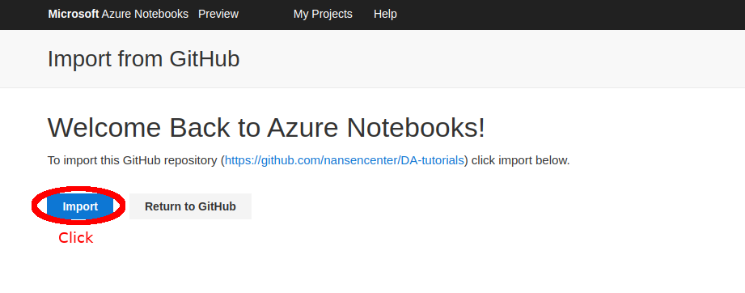
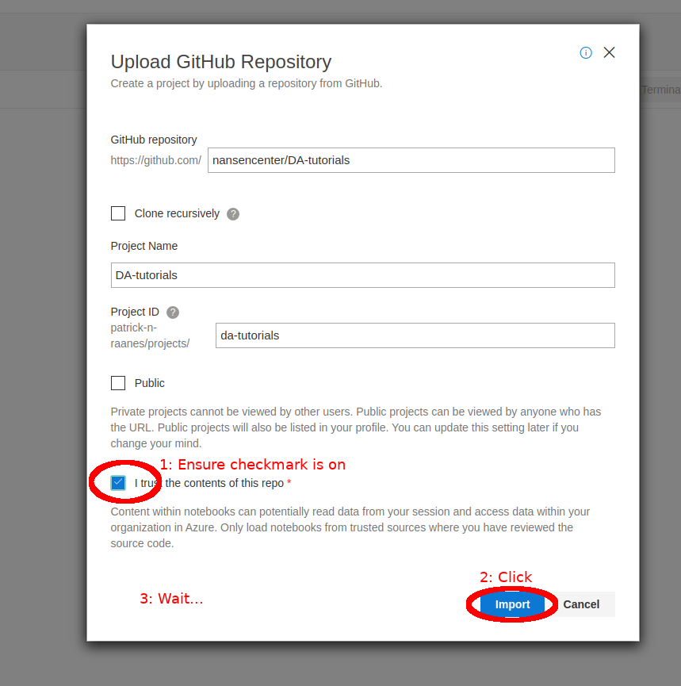
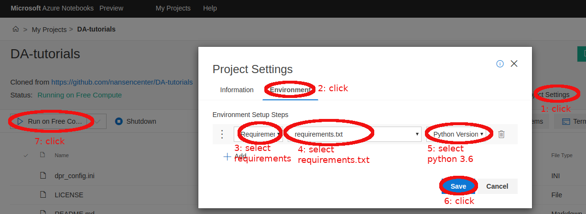
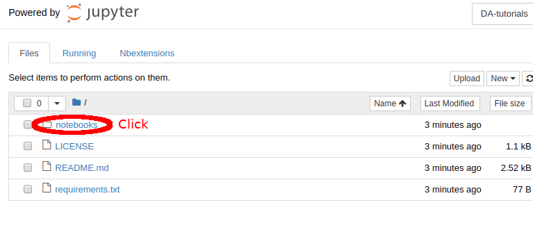
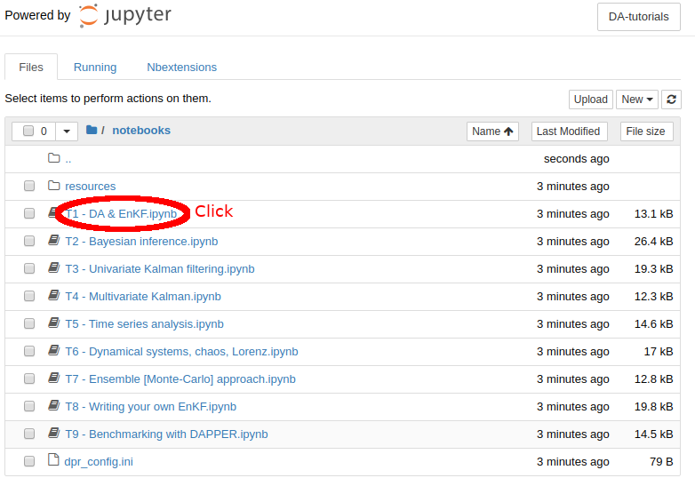
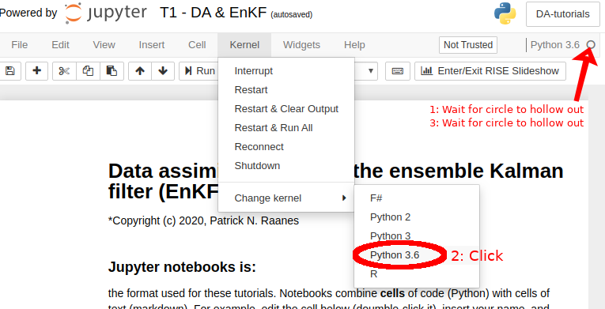

# Setup for MS Azure
This details how to get MS Azure to set up the correct python environment.

NB: My personal experience of this service has been mixed.
It seems very fickle.
On a good day, it works like a charm.
On a bad day, it won't install the requirements,
but I have no idea why.

# Next:

# Next:

# Next:

# Next:

# Next:

